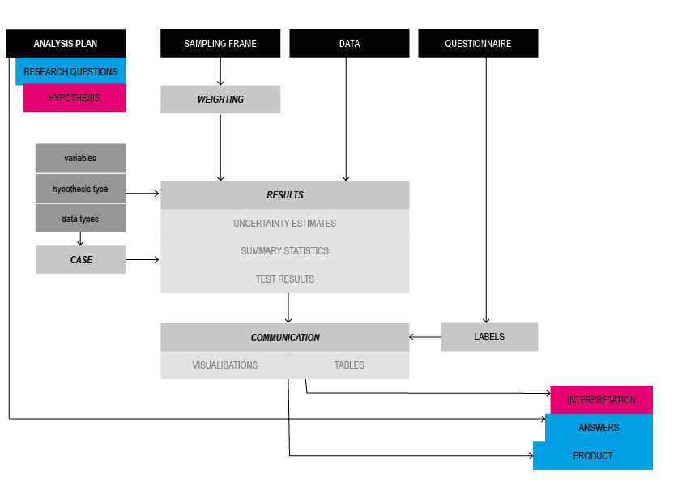
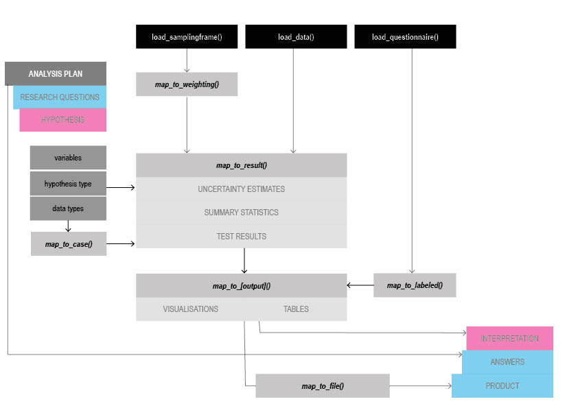

```{r setup, include = FALSE}
knitr::opts_chunk$set(
  collapse = TRUE,
  #,comment = "#>",
  eval=F
  )
```

# Logic

## Analysis Flow

The flow of an analysis according to the data analysis guidelines:



The implementation in hypegrammaR:




## Main steps


Any analysis with HypegrammaR follows the same structure:

- Load your input data
- decide your analysis parameters
    - what type of hypothesis do you have?
    - what are the the dependent and independent variables, and what are their data types?
- _map_ from your main parameters to a distinct *analysis case*.
- _map_ your *raw inputs* and *analysis case* to receive an analysis *result*
- _map_ your *result* to a *visualisation* / *table* or other appropriate outputs
- _map_ your outputs to a *file*


## Example

### Once (ever per machine):
```{r,eval=F}
remotes::install_github('ellieallien/hypegrammaR',build_opts = c())
remotes::install_github('mabafaba/surveyweights',build_opts = c())
remotes::install_github('mabafaba/koboquest',build_opts=c())

```
### Once per Assessment

#### Load the hypegrammaR package
```{r,warning=FALSE,message=FALSE, eval = T}
library(hypegrammaR)

```

#### Load your files

All input files are expected as csv files.

Each input we usually expect with an assessment has it's own function to load it. They check that the format is in line with what is expected, make sure they play well with each other and prepare the functionality they are used for.

First the data. A csv file with data in standard Kobo format.

```{r}
assessment_data<-load_data(file = "../data/testdata.csv")
```

Then a sampling frame. A csv file with one column with strata names, one column with population numbers. The strata names must match exactly some values in the data. We must tell the loading function which column is what in the sampling frame.
```{r}
sampling_frame<-load_samplingframe("../data/test_samplingframe.csv")
```

Finally the questionnaire, which depends on the question and the choices sheet as a csv.

```{r,eval=F}

questionnaire<-load_questionnaire(data = assessment_data,
                                             questions = "../data/test_questionnaire_questions.csv",
                                             choices = "../data/test_questionnaire_choices.csv",
                                  choices.label.column.to.use = "label::English"
                                             )

```


#### _Map_ to weighting
```{r,eval=F}

weighting <- map_to_weighting( sampling.frame = sampling_frame,
                               data.stratum.column = "stratification",
                               sampling.frame.population.column = "population",
                               sampling.frame.stratum.column = "strata.names",
                               data = assessment_data)

```

### For each Hypothesis

### _Map_ to the analysis case
You need to know:

- The hypothesis type. Currently implemented are:
  - `direct_reporting`
  - `group_difference`
  - `limit`
- the names of the columns that are your dependent and independent variables

```{r,eval=T}

case <- map_to_case(hypothesis.type = "group_difference",
                    dependent.var.type = "numerical",
                    independent.var = "categorical")

case
```


## Now put it all together and _Map_ to the result:

```{r, eval = F}

result<-map_to_result(data = assessment_data,
              dependent.var = "number_simultaneous_unmet_need",
              independent.var =   "region",
              case = case,
              weighting = weighting)
```

### See the results

The `map_to_result` function gives you a number of things:

- A log message
- Meta information: a log of your inputs, what analysis case was used etc.
- The summary statistics (e.g. averages, percentages, ...)
- The hypothesis test results
- A visualisation

#### The log message

First, a message telling you how it went:
```{r,eval=F}
# result$message
```
That's what we want to see. If something went wrong, it should tell you here what happened.

#### meta information

```{r,eval=F}
# result$parameters
```
As you can see, it remembers what your input parameters were. It also added a standardised name of the analysis case.

#### The summary statistic

```{r,eval=F}
# result$summary.statistic
```

In this case, "numbers" are averages, because the input variable was numerical. `min` and `max` is the corresponding confidence interval. `dependent.var.value` give the corresponding variable values if they are categorical (`NA` otherwise.)
The summary statistic will _always_ be organised with exactly these columns, no matter what analysis you did. This is so that if you add a new visualisations or ouput format, it will work for any output from this function.

#### The hypothesis test

Next, there's information on which (if any) hypothesis test was used and the p value:
```{r,eval=F}
result$hypothesis.test

```
You'll probably be most interested in the p-value and the type of test that was used.


## Add labels

## _Map_ to usable outputs

### Chart
```{r,warning=FALSE,eval=F}

chart<-map_to_visualisation(result)
heatmap<-map_to_visualisation_heatmap(result)
chart
```

For advanced users (that know ggplot): The visualisation function returns a ggplot object, so you can add/overwrite ggplot stuff; for example:
```{r,warning=F,eval=F}
myvisualisation+coord_polar()

```

### gimme Labels!
```{r,warning=FALSE}
result %>% map_to_labeled(questionnaire) -> result_labeled
chart <- result_labeled %>% map_to_visualisation
heatmap <- result_labeled %>% map_to_visualisation_heatmap


```


### Save as files

```{r, eval=FALSE}
map_to_file(chart,"barchart.jpg")
map_to_file(result$summary.statistic,"summary_statistics.csv")

```

The grammar is built from two types of elements:
- "Blocks": Take the output of a mapping
- "Mappings": Decide what to do, call a "block" that does it, and returns another block.


